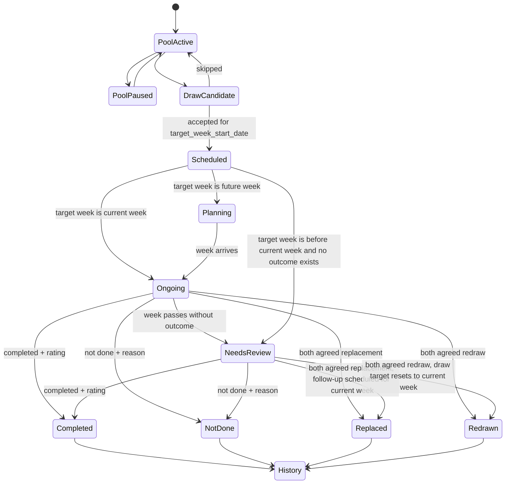

# State Machine

## Principle

History is outcome-driven. Draw, acceptance, and scheduling are planning states, not historical facts.

## Activity Lifecycle

## Session Statuses

| Status | Meaning | History? |
| --- | --- | --- |
| `planning` | Accepted for a future target week | No |
| `ongoing` | Target week is current week | No |
| `needs_review` | Target week is before current week and no outcome exists | No |
| `completed` | Done with a simple rating | Yes |
| `not_done` | Missed with a reason | Yes |
| `replaced` | Manually replaced with both members agreeing | Yes |
| `redrawn` | Redrawn with both members agreeing | Yes |

## Outcome Ratings

Completed sessions use one simple rating:

- `夯`
- `顶级`
- `人上人`
- `NPC`
- `拉完了`

## Agreement Rules

Replacement and redraw outcomes require both members agreeing. Store explicit agreement records or fields so the outcome is auditable.

## Week Classification

For a pair timezone:

- If `target_week_start_date` is after the current week start, show under Planning.
- If `target_week_start_date` equals the current week start and no outcome exists, show under This Week / Ongoing.
- If `target_week_start_date` is before the current week start and no outcome exists, show under Needs Review / Overdue.
- If an outcome exists, show under History regardless of target date.
- Replacing or redrawing a Needs Review / Overdue session archives the overdue session and schedules the follow-up for the current week by default.

## Forbidden Transitions

- Draw candidate directly to History.
- Accepted scheduled session directly to History without outcome details.
- Future scheduled session to completed before its target week unless the user explicitly records an early outcome in a later version.
